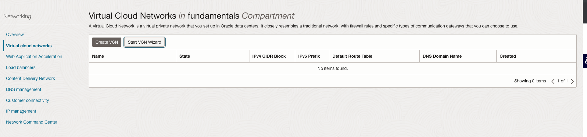
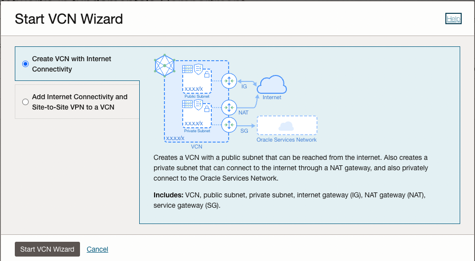
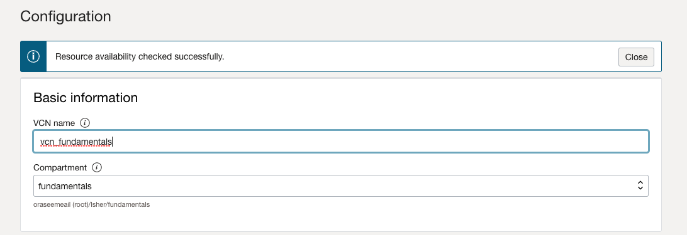
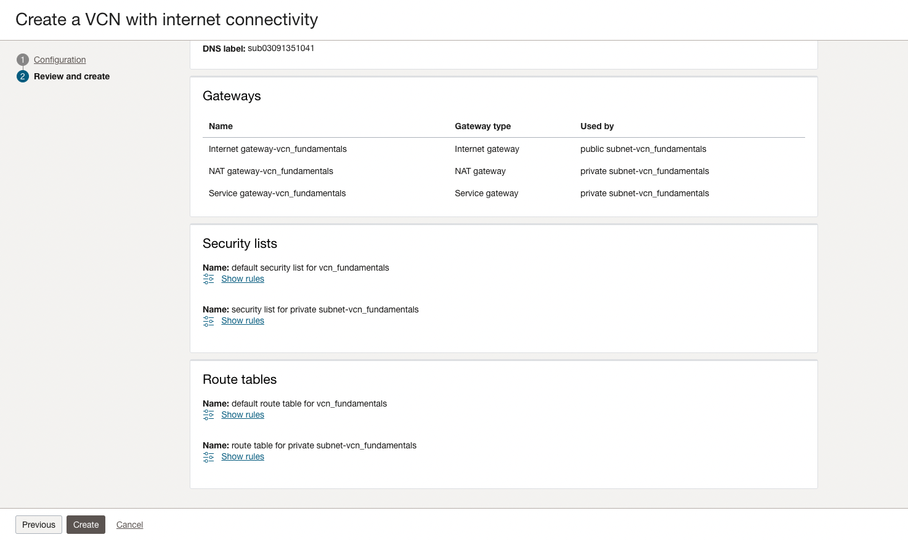
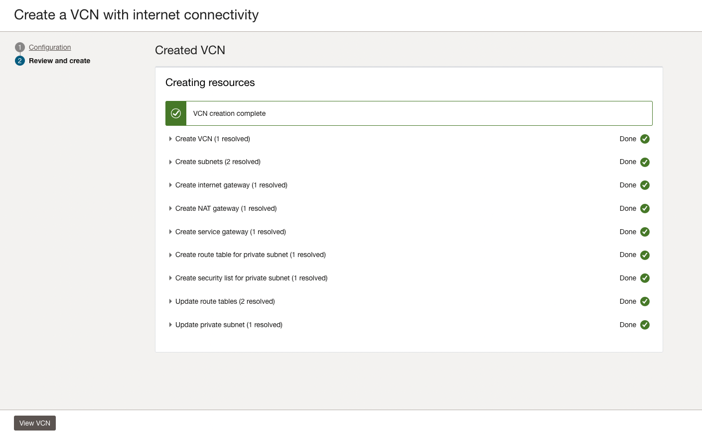
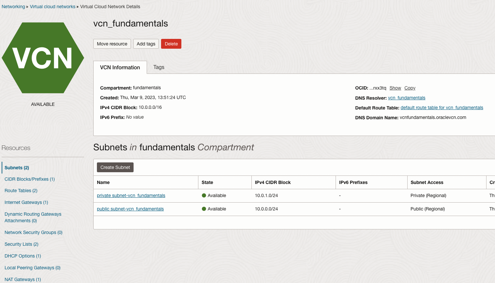

# Create VCN
1. Open the navigation menu and click **Networking** &rarr; **Virtual Cloud Networks** 

2. Click on **Start VCN Wizard**

    

3. Click on **Start VCN Wizard**

    

4. Fill the name of the VCN and leave everything else as default

    

5. Scrolldown and click on **Create**

     

6. Click on **View VCN**

    
