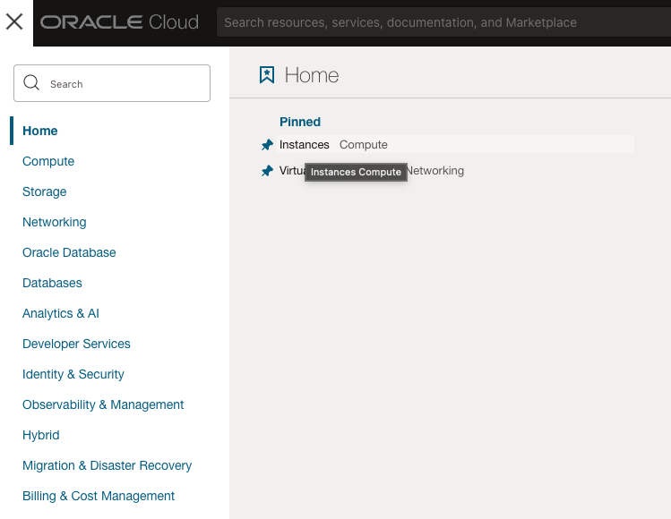
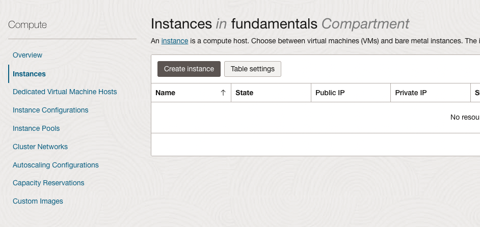
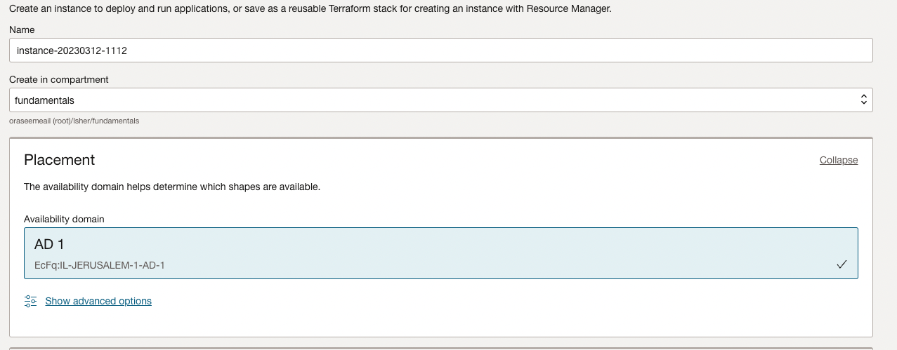
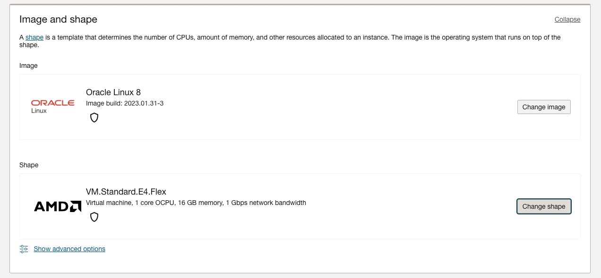
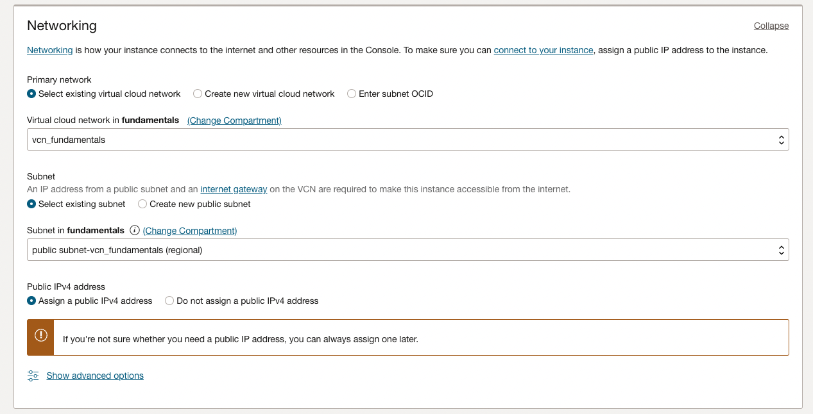
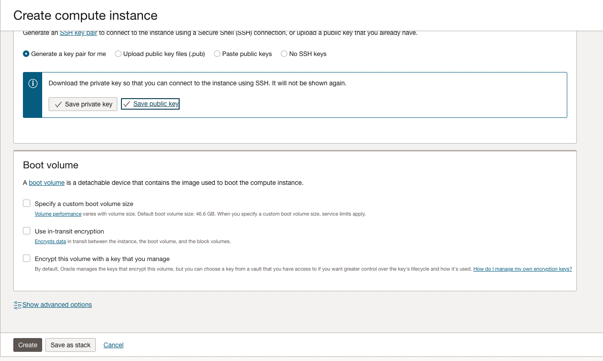
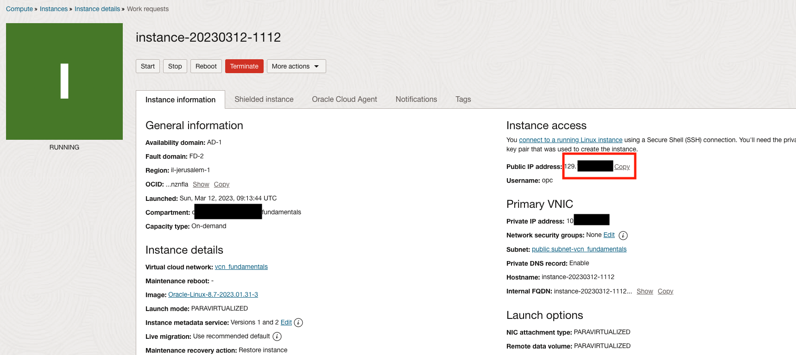

# Create Compute Intance
1. Open the navigation menu and click **Compute** &rarr; **Instances**

    

2. Click on **Create Instance**

    

3. Click on **Enter Instance Name as you wish**

    

4. Pick Oracle Linux and choose the amount of oCPU required.

    

5. Select the VCN you want and make sure to place on in the Public Subnet

     

6. Save the private key and the public key

    

7. Click on Create

    

8. Copy the public address

    

